<h1 align="center">LKR P2P Rate</h1>

<p align="center">
  <b>The USDT/LKR P2P rate, and any currency exchange rate, on your Android home screen.</b><br>
  Resizable widgets and a companion app that read the public Binance P2P order book
  and show the best rate you can <i>actually</i> get, with a trend chart, a converter,
  the live list of ads and rate alerts, plus a second widget for ordinary exchange
  rates on any currency pair, in nine colour themes.
</p>

<p align="center">
  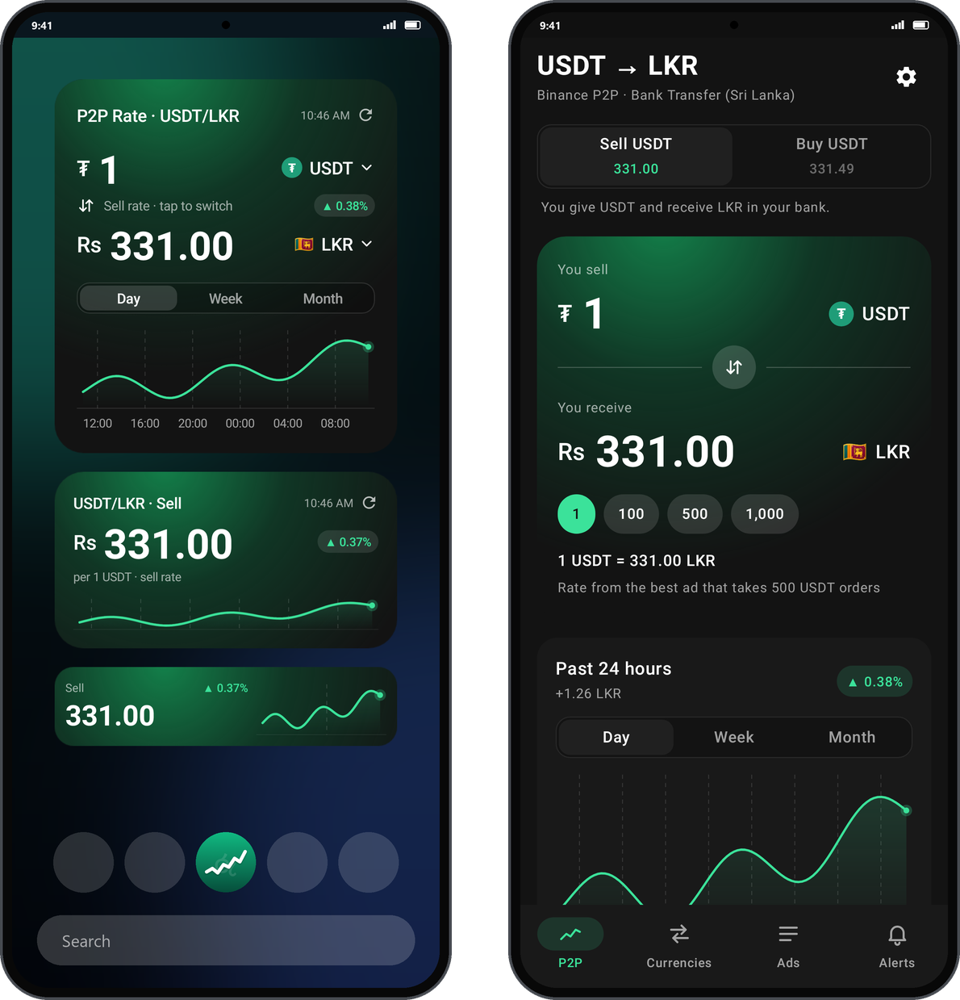
</p>

<p align="center">
  Kotlin · Jetpack Compose · Jetpack Glance · Android 8.0+ · no account, no ads, no tracking<br>
  <b>Free and open source</b> under the <a href="LICENSE">MIT License</a>
</p>

---

## Contents

- [At a glance](#at-a-glance)
- [The widget](#the-widget)
  - [Anatomy](#anatomy-of-the-full-widget)
  - [Sizes and layouts](#sizes-and-layouts)
  - [Day, Week, Month and Buy](#day-week-month-and-buy)
  - [When the rate is out of date](#when-the-rate-is-out-of-date)
  - [Adding a widget](#adding-a-widget)
- [Exchange Rate widget](#exchange-rate-widget)
- [Colour themes](#colour-themes)
- [The app](#the-app)
  - [Rate](#rate-p2p-tab) · [Converter](#converter) · [Currencies](#currencies) · [Ads](#ads) · [Alerts](#alerts) · [Settings](#settings)
- [How the rate is worked out](#how-the-rate-is-worked-out)
- [How often it updates](#how-often-it-updates)
- [Privacy](#privacy)
- [Open source](#open-source)
- [For developers](#for-developers)
  - [Project layout](#project-layout) · [Build](#build) · [Screenshots](#regenerating-the-screenshots) · [Install on your phone](#install-on-your-phone) · [Publish to Google Play](#publish-to-google-play)

---

## At a glance

| | |
|---|---|
| **What it shows** | The price of **1 USDT in Sri Lankan rupees** on Binance P2P, for selling and for buying |
| **Where the price comes from** | The best ad that will accept your usual order size (500 USDT by default), not the headline ad with a minimum you can't meet |
| **Widgets** | **USDT/LKR Rate**: resizable from a 2x1 strip to a full 4x4 card, with its own Day/Week/Month chart and Sell/Buy switch. **Exchange Rate**: any currency pair (USD/LKR, EUR/USD, AED/LKR, BTC/LKR…) with a 1W/1M/3M/1Y chart |
| **Themes** | Nine colour themes for the app and the widgets, adjustable widget transparency, and a theme per widget |
| **App** | P2P, Currencies, Ads and Alerts tabs plus Settings |
| **Updates** | In the background every 15 minutes (30 or 60 if you prefer), with no notification; on demand when you open the app, pull down or tap ⟳ |
| **Data** | 30 days of P2P history and the downloaded exchange rates, kept on the phone only. Exportable as CSV |
| **Requirements** | Android 8.0 (API 26) or newer, phones and tablets |

---

## The widget

### Anatomy of the full widget

<p align="center">
  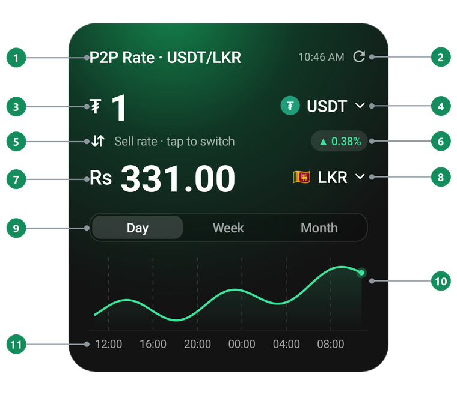
</p>

| # | Part | What it shows | What tapping it does |
|---|---|---|---|
| 1 | **Title** | "P2P Rate · USDT/LKR" | Opens the app |
| 2 | **Last updated · ⟳** | The time of the newest rate. Turns amber and says **Stale** when it is too old (see [below](#when-the-rate-is-out-of-date)) | ⟳ fetches a fresh rate straight away |
| 3 | **₮ 1** | The amount being priced: always 1 USDT | Opens the app |
| 4 | **USDT** | The coin, with the Tether badge | Opens the app |
| 5 | **↓↑ Sell rate · tap to switch** | Which side this widget shows | Flips this widget between the **Sell** and **Buy** rate |
| 6 | **Trend chip** | Change from the first to the last point of the chart window. Green ▲ when the rate went up, red ▼ when it went down | Opens the app |
| 7 | **Rs 331.00** | The rate: what 1 USDT is worth in rupees right now | Opens the app |
| 8 | **LKR** | The currency, with the Sri Lankan flag | Opens the app |
| 9 | **Day · Week · Month** | The chart window. The selected one is highlighted | Switches this widget's chart window |
| 10 | **Chart** | The rate over the window: a mint line over a soft fill, dashed gridlines, and a dot on the newest point. Green when the window ends higher, red when it ends lower. Gaps in collection show as breaks, never as a made-up flat line | Opens the app |
| 11 | **Time axis** | Hours for Day, weekdays for Week, dates for Month | Opens the app |

Every widget remembers its own side and window, so you can keep a Sell widget and a
Buy widget side by side, or one per chart window.

### Sizes and layouts

<p align="center">
  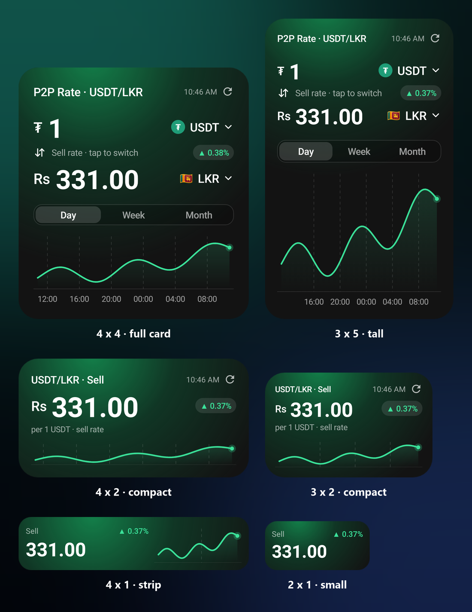
</p>

The widget is resizable in both directions. Every instance knows its exact size and
picks the layout that fits:

| Layout | When | What it shows |
|---|---|---|
| **Full card** | 250dp tall and 200dp wide or more (about 4x4 or 3x5 cells) | Everything in the anatomy above. Taller widgets give the chart more room; narrower ones shrink the type |
| **Compact** | 110dp tall and 170dp wide or more (about 4x2 or 3x2 cells) | "USDT/LKR · Sell", the time and ⟳, the big rate, "per 1 USDT · sell rate", the trend chip and a chart (time labels appear when there is room). Tap the title to flip Sell/Buy |
| **Strip / small** | Anything smaller (4x1, 2x1) | The side, the rate and the trend chip, plus a sparkline on the right when the strip is wide enough. Tap "Sell"/"Buy" to flip |

Fitting rules that keep it readable on any phone:
- Text sizes scale with the widget's width, and the big numerals shrink before they
  would run into the currency badge.
- Text is sized in dp, so the system font-size setting can't push it out of the
  space it was measured for.
- Corners follow your launcher's own widget radius, capped on short strips so they
  don't turn into pills.
- On a narrow 2x1 the trend moves up next to the label instead of being cut off.

### Day, Week, Month and Buy

<p align="center">
  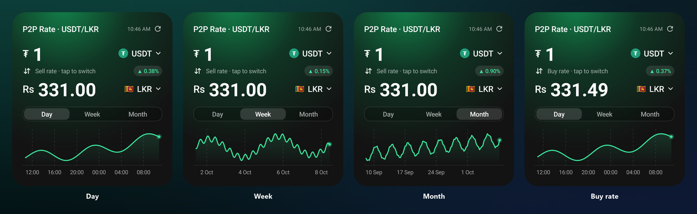
</p>

| Window | Covers | Each point is | Axis |
|---|---|---|---|
| **Day** | The last 24 hours | Every collected rate (about every 15 minutes) | Every 4 hours |
| **Week** | The last 7 days | The average for each hour | Weekdays |
| **Month** | The last 30 days | The average for each 6 hours | Weekly dates |

The trend chip always compares the start of the selected window with now, so the
same widget can read ▲ 0.37% on Day and ▲ 0.99% on Month.

**Buy rate** (right) is what you pay for 1 USDT. It is normally a little above the
Sell rate; the gap is the market's spread.

### When the rate is out of date

<p align="center">
  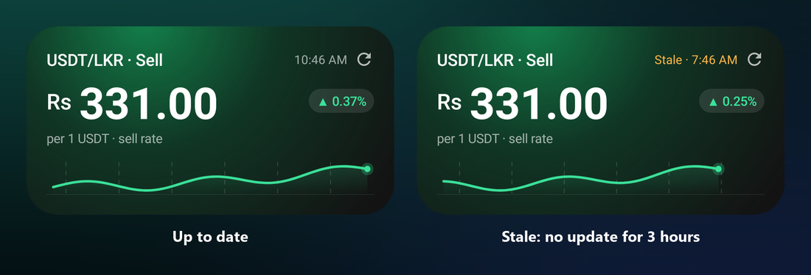
</p>

If the newest rate is older than three missed updates (**45 minutes** at the default
15-minute interval), the time turns amber and reads **Stale**. This usually means the phone was offline,
or battery saver held back background work. Tap ⟳ or open the app to fetch a fresh
rate. The chart keeps the gap as a break so it never pretends the rate stood still.

### Adding a widget

1. Open **LKR P2P Rate** once, so it can collect its first rate.
2. Long-press an empty spot on your home screen → **Widgets** → **LKR P2P Rate** →
   drag **USDT/LKR Rate** onto the screen. Or use **Settings → Add a widget to the home
   screen** in the app.
3. Long-press the widget and drag its handles to resize it. The layout changes as you go.
4. Choose which side new widgets start on in **Settings → New widgets show**.
5. To give one widget its own colour theme, long-press it and choose **Settings**
   (or **Reconfigure**, depending on the launcher).

---

## Exchange Rate widget

<p align="center">
  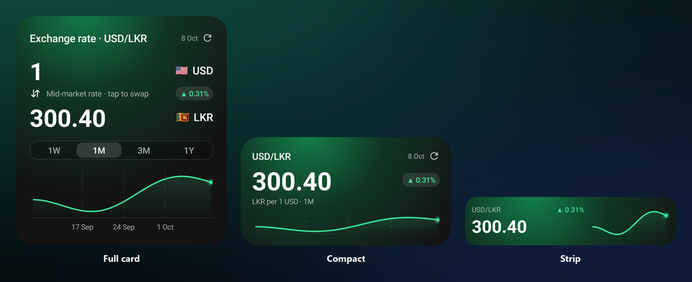
</p>

A second, separate widget for ordinary currency conversion. It covers any pair from
**300+ currencies**: the Gulf currencies, USD, EUR, GBP, INR, AUD and the rest, plus the
main coins such as BTC and ETH.

- **Pick the pair** on the setup screen that opens when you add the widget. On Android
  12+ that step is optional: the widget starts on the pair last used in the Currencies
  tab, and you can change it later from its long-press menu.
- **1W / 1M / 3M / 1Y** switches the chart range.
- **↓↑** swaps the pair (USD/LKR becomes LKR/USD).
- **⟳** fetches the latest rates. Tapping anywhere else opens the Currencies tab.

These are **daily mid-market reference rates**, the kind banks and online converters
quote. They are not what a P2P trader will pay you for USDT, which is why this is its
own widget and the P2P widget stays P2P-only.

The rates come from the free, open-source
[fawazahmed0/exchange-api](https://github.com/fawazahmed0/exchange-api), which needs
no API key. It publishes one file a day with every currency priced in US dollars, so
any pair is worked out through the dollar: EUR→LKR = (LKR per USD) ÷ (EUR per USD).
The app checks for a new day every few hours. The first time you open a longer chart
range, it fetches the older days once (about 45 files at most per range). Everything is
saved on the phone, so the widget and converter keep working offline with the last
saved day.

---

## Colour themes

<p align="center">
  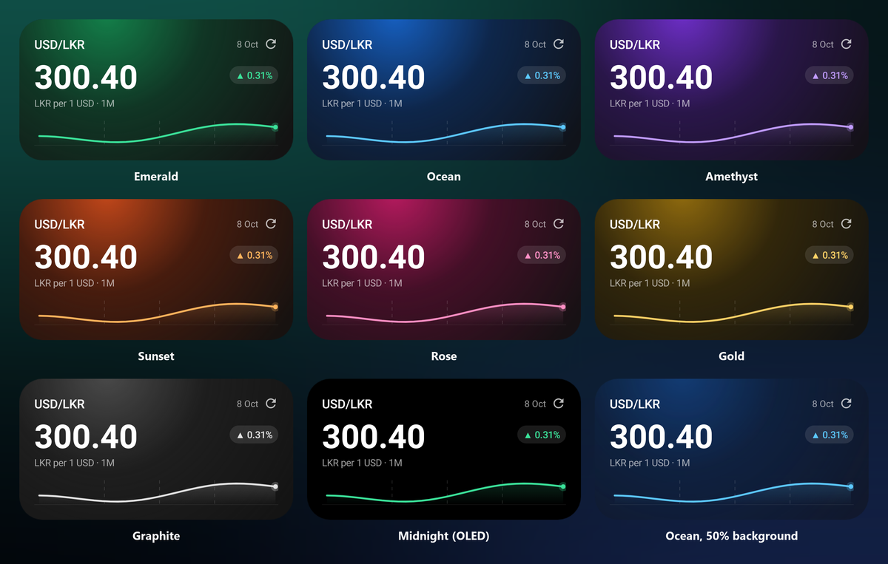
</p>

Nine themes, all dark. Each one changes the glow, the accent colour and the chart line:
**Emerald** (default), **Ocean**, **Amethyst**, **Sunset**, **Rose**, **Gold**,
**Graphite**, **Midnight** (pure black, for OLED screens) and **Wallpaper** (Material
You: picks up your wallpaper's colours on Android 12 and later).

- **Settings → Appearance → App theme** colours the app.
- **Widget theme** colours every widget. **Same as app** follows the app theme.
- **Widget background** sets the card's opacity, from 100% down to fully transparent,
  so your wallpaper can show through.
- **One widget only**: long-press it, open its settings and pick a theme for just that
  widget. **Default** puts it back on the theme from Settings.

---

## The app

The app is for the moments the widget can't cover: converting an amount, seeing which
ad you'd actually trade with, or setting an alert. Everything works one-handed, and the
everyday question, "what's the rate right now?", needs no taps at all.

<table>
  <tr>
    <td align="center" width="20%">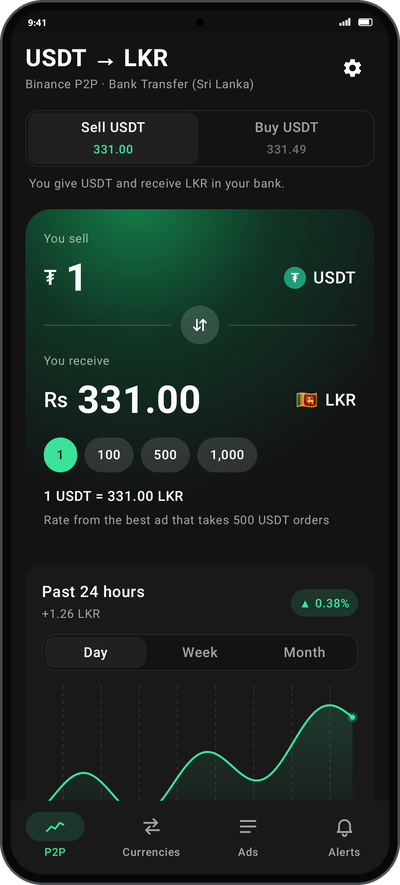<br><b>P2P</b></td>
    <td align="center" width="20%">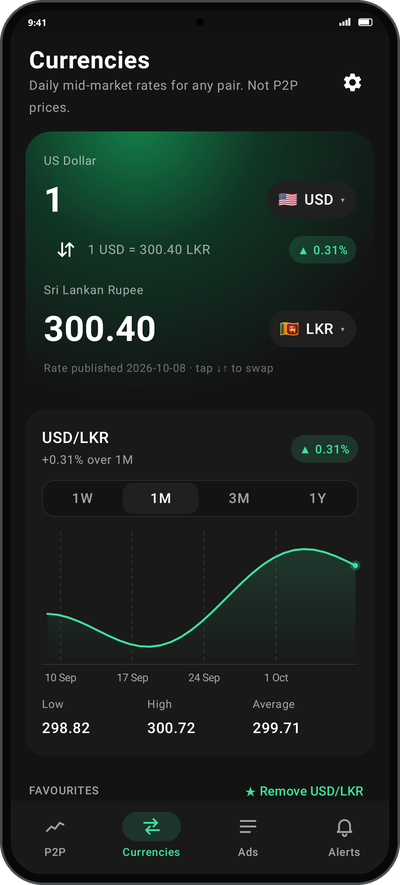<br><b>Currencies</b></td>
    <td align="center" width="20%">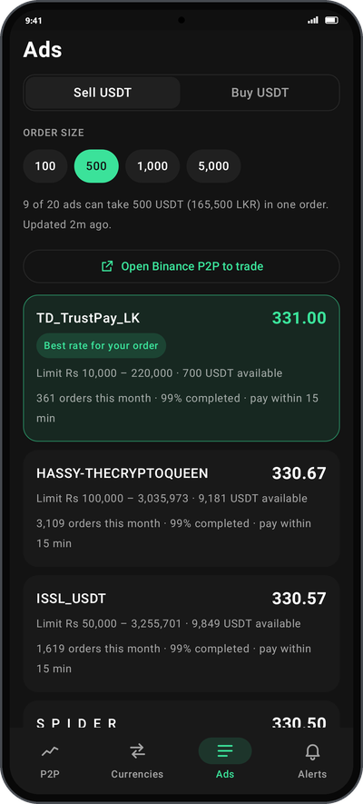<br><b>Ads</b></td>
    <td align="center" width="20%">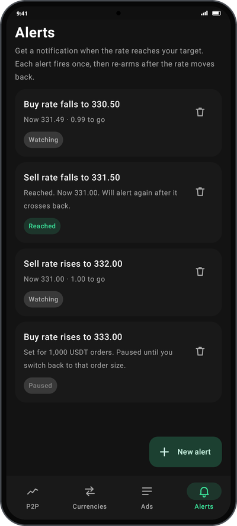<br><b>Alerts</b></td>
    <td align="center" width="20%">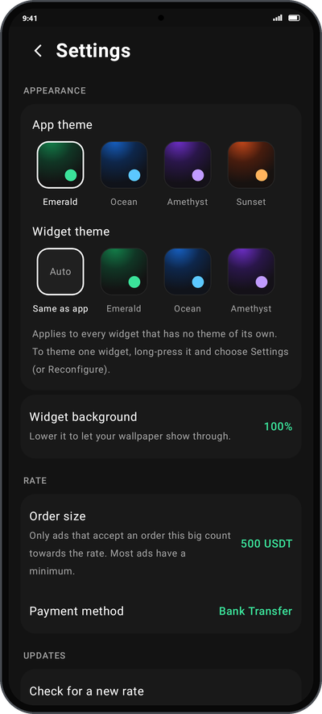<br><b>Settings</b></td>
  </tr>
</table>

### Rate (P2P tab)

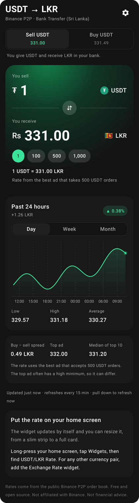

The home tab. Scroll down for more detail; pull down anywhere to refresh.

- **Header**: the pair, the payment method being tracked
  (Bank Transfer, Sri Lanka) and the ⚙ Settings button.
- **Sell USDT / Buy USDT switch**: both live rates at once.
  The selected side drives everything below it, and the line underneath says what it
  means in plain words ("You give USDT and receive LKR in your bank").
- **Converter card**: see [Converter](#converter).
- **Chart card**:
  - The title and change for the window, e.g. "Past 24 hours · +1.26 LKR · ▲ 0.38%".
  - **Day / Week / Month**.
  - **Press or drag on the chart** to read the exact rate and time at any point.
    The header shows it while your finger is down.
  - **Low**, **High** and **Average** for the window.
- **Market card**:
  - **Buy – sell spread**.
  - **Top ad**: the headline price, even if it needs a large minimum.
  - **Median of top 10**: a steadier view of the market.
  - A one-line reminder of why the rate can differ from the top ad.
- **Status line**: "Updated just now · refreshes every 15 min · pull down to refresh
  now". It turns amber if the rate is stale.
- **Widget tip**: shown only until you've added a widget.

<br clear="right">

### Converter

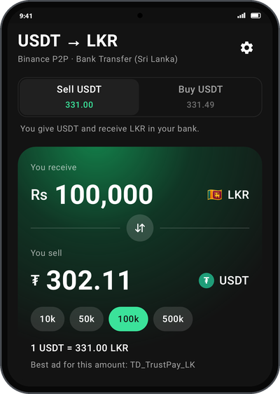

Part of the P2P tab, built for the two questions people actually ask: *how many
rupees do I get for this much USDT*, and *how much USDT do I need for this many rupees*.

- It starts at **1 USDT**. Type any amount; thousands separators are added as you type.
- **↓↑** swaps the direction, and the result becomes the new input, so the numbers on
  screen stay put. Here 100,000 LKR needs 302.11 USDT.
- **Quick amounts** change with the direction: 1 / 100 / 500 / 1,000 USDT, or
  10k / 50k / 100k / 500k LKR.
- The line under the card names the rate used and why:
  - "Best ad for this amount: TD_TrustPay_LK" when an ad accepts exactly that order.
  - "Rate from the best ad that takes 500 USDT orders" when the amount is below every
    ad's minimum, as 1 USDT always is.
  - "No single ad takes this much" when the order is larger than any ad allows.

<br clear="right">

### Currencies


A converter for any pair, built for the everyday "how much is 250 dollars in rupees?".

- **Type an amount** and pick both currencies from a searchable list of 300+
  (search by code or name). **↓↑** swaps them.
- **Chart** for 1W, 1M, 3M or 1Y, with the low, high and average for the range.
- **Favourites**: USD, EUR, GBP, AED and INR against LKR to start with. Star the
  current pair to add it, or tap a favourite to load it.
- **Add widget** puts an Exchange Rate widget for the current pair on your home screen.
- **Export CSV** shares every saved day of the current pair.
- Pull down to refresh. Rates are daily reference rates, not P2P prices.

<br clear="right">

### Ads

The live order book for the selected side and payment method.

- **Order size chips** (100 / 500 / 1,000 / 5,000 USDT) re-filter the list instantly,
  without changing your saved setting.
- A summary says how many ads can take the order and what it is in rupees: "9 of 20
  ads can take 500 USDT (165,500 LKR) in one order. Updated 2m ago."
- **Open Binance P2P to trade** jumps to the same market in the Binance app or website.
  This app never trades or holds money.
- **Each ad card** shows:
  - The advertiser and the price.
  - The rupee limits and the USDT available.
  - Orders this month, completion rate and payment window.
- The best ad for your order is highlighted as **Best rate for your order**.
- Ads that can't take your order are folded under "Show N ads that can't take this
  order". Each one says why: below the minimum, above the maximum, or not enough USDT.

### Alerts

Get a notification when the rate reaches your target.

- Tap **New alert** to choose the side, **Rises to** or **Falls to**, and the target.
  The target is pre-filled from the live rate, with −1 / +1 buttons to nudge it.
- Each alert reads like a sentence ("Sell rate rises to 332.00") with progress
  underneath ("Now 331.00 · 1.00 to go").
- **Status** chips:
  - **Watching**: waiting for the rate to cross your target.
  - **Reached**: the alert has fired. It fires once, then re-arms when the rate
    crosses back, so a rate hovering around your target doesn't spam you.
  - **Paused**: the alert was set for a different order size. It resumes when you
    switch back.
- If notifications are turned off, a banner explains it and takes you to the switch.
- Alerts are checked on the phone after every update. Nothing is sent to a server.

### Settings

Open with ⚙ on the P2P or Currencies tab.

| Setting | Options | What it does |
|---|---|---|
| **App theme** | Nine themes | Colours the app. See [Colour themes](#colour-themes) |
| **Widget theme** | Same as app, or any theme | Colours every widget that has no theme of its own |
| **Widget background** | 100%, 85%, 70%, 50%, 30%, transparent | How much of the wallpaper shows through the widgets |
| **Order size** | 100, 500, 1,000, 5,000 or any amount | Only ads that accept an order this big count towards the rate. Set it to roughly what you trade. Each size keeps its own history |
| **Payment method** | Bank Transfer (Sri Lanka), Bank Transfer | Which ads are tracked |
| **Check for a new rate** | Every 15, 30 or 60 minutes | How often background updates run. No notification is shown |
| **Battery use** | Shows Unrestricted or Optimised | Opens the system page where you can let the app run in the background. See [How often it updates](#how-often-it-updates) |
| **New widgets show** | Sell rate, Buy rate | The starting side for widgets you add. Each widget can still flip on its own |
| **Add a widget to the home screen** | | Asks your launcher to place a widget (on launchers that support it) |
| **Open source** | | Opens this repository |
| **Export P2P history** | CSV | Shares every saved sample from the last 30 days |

---

## How the rate is worked out

P2P ads have minimum and maximum order sizes in rupees. The first ad in the list
often needs an order far bigger than most people trade, so quoting it would be
misleading. Instead:

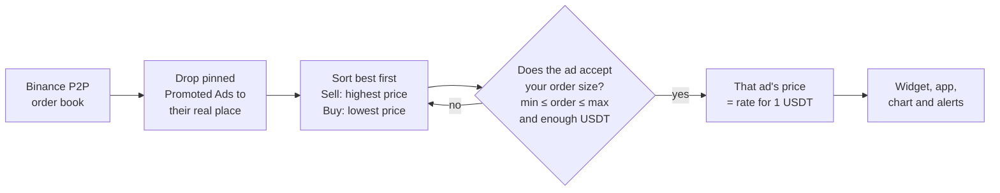

- **Sell USDT**: you give USDT and receive rupees. The best ad pays the most.
- **Buy USDT**: you pay rupees and receive USDT. The best ad charges the least.
- Binance pins "Promoted Ad" listings at the top regardless of price. They are put
  back in price order before anything is picked.
- Everything is shown **per 1 USDT**. The order size (500 USDT by default) only decides
  which ad is usable.

---

## How often it updates

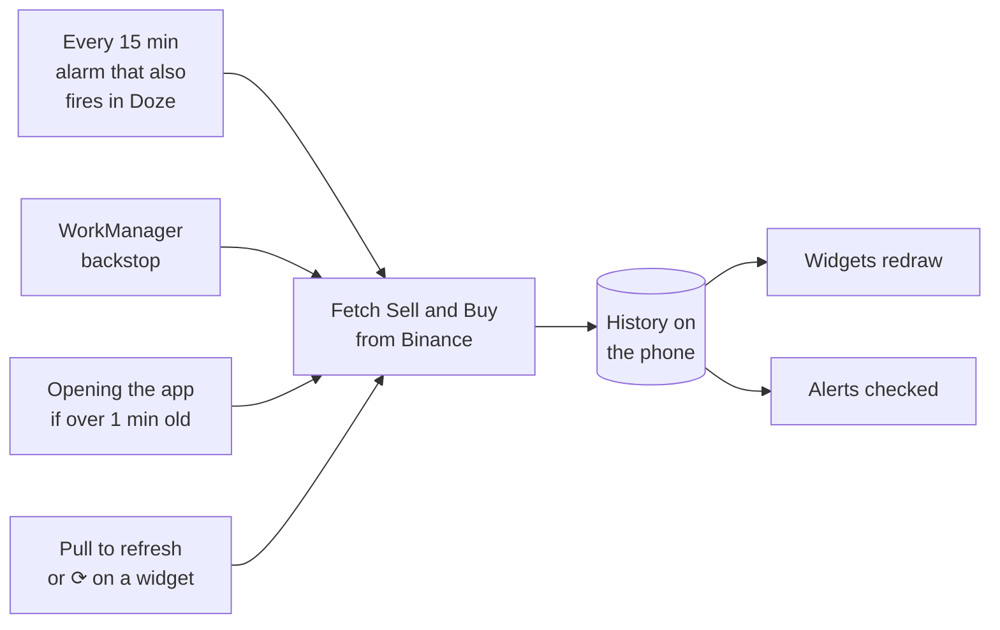

- **15 minutes is the shortest interval Android allows** for ordinary background work.
  Anything faster needs a foreground service, which means a permanent notification,
  more battery use and stricter Play Store rules. That isn't worth it for a rate widget.
- **Updates keep running while the phone sleeps.** Android's Doze mode used to hold
  back the background job for hours overnight, so the chart showed short pieces with
  gaps. Updates are now driven by an alarm that still fires in Doze, with WorkManager as
  a backstop. It needs no special permission and shows no notification.
- **Phone makers add their own limits** on top of Doze (Samsung "sleeping apps",
  Xiaomi, Oppo, Vivo, Huawei). **Settings → Battery use** shows whether the app is
  restricted. Tap it and set battery usage to **Unrestricted**.
- **Any remaining gap** (no internet, phone switched off) is bridged with a faint
  dashed line, so the chart reads as one series. No price is invented for that time.
- **Exchange rates** change once a day, so they are checked every few hours along with
  the P2P rate.
- Both sides are collected every time, so any widget can flip without a gap in its
  history.

---

## Privacy

- **Nothing about you is collected.** There is no account, analytics, advertising
  or crash reporting.
- **Network requests** go to Binance's public P2P search endpoint (containing only the
  currency pair, payment method and page size) and, for exchange rates, to the
  open-source currency-api's daily files on jsDelivr / Cloudflare. Those are plain file
  downloads: nothing about you or the pairs you look at is sent.
- **Local data**: P2P history (30 days), downloaded exchange rates, favourites,
  settings and alerts stay in the app's private storage. Uninstalling the app deletes
  them.

The full policy is in [PRIVACY.md](PRIVACY.md).

Not affiliated with Binance. Not financial advice.

---

## Open source

LKR P2P Rate is free and open source under the [MIT License](LICENSE). You may use,
copy, change and share the code, including in your own apps, as long as the copyright
notice and license text come with it. Bug reports, ideas and pull requests are welcome
in [Issues](https://github.com/ruchira-edirisinghe/p2p-lkr-widget-app/issues).

---

## For developers

### Project layout

| Path | Contents |
|---|---|
| `app/src/main/java/dev/dfanso/lkrp2p/core/` | Wire format, Binance client, fillable/median metrics, trend, converter, edge-triggered alerts |
| `.../data/` | SQLite history store, settings, the poller |
| `.../work/` | WorkManager collector and alert notifications |
| `.../render/` | Background and chart painters shared by the widget and the app |
| `.../widget/` | Jetpack Glance widget with three size-dependent layouts |
| `.../ui/` | Compose app: Rate, Ads and Alerts tabs plus Settings |
| `app/src/test/` | Unit tests against recorded Binance responses, and screenshot tests |
| `docs/` | README images and the script that builds them |
| `play/` | Store icon (512px), feature graphic (1024x500) and its generator |
| `PRIVACY.md` | Privacy policy to host for the Play listing |

### Build

Requirements: JDK 17+ and the Android SDK (platform 36). Android Studio bundles
both; open this folder in it and press Run. From a terminal:

```sh
./gradlew testDebugUnitTest   # unit tests + screenshot renders
./gradlew assembleDebug       # app/build/outputs/apk/debug/app-debug.apk
./gradlew lintDebug           # Android lint
```

`local.properties` (git-ignored) must point at the SDK, for example
`sdk.dir=C\:/Users/you/AppData/Local/Android/Sdk`.

### Regenerating the screenshots

Every image in this README is the real app code rendered by Robolectric, with
no mock-ups. The screenshot tests seed realistic history and the recorded order
books, then render:

- every widget size and state, the Exchange Rate widget and one card per colour theme
  into `app/build/widget-shots/`
- every app screen, including the Currencies tab and an Ocean-themed P2P tab, into
  `app/build/app-shots/`

Exchange rates in the tests come from an offline fake, so no test touches the network.

`docs/make_readme_images.py` frames and labels them:

```sh
./gradlew testDebugUnitTest
py docs/make_readme_images.py      # needs Pillow; writes docs/images/
```

The render tests need an x64 JDK, because Robolectric's native graphics have no
ARM64 Windows build.

### Install on your phone

1. On the phone: Settings → About phone → tap **Build number** 7 times →
   Developer options → enable **USB debugging**.
2. Connect by USB and run `./gradlew installDebug`. **Or** copy `app-debug.apk` to the
   phone and open it (allow "install unknown apps" for your file manager).
3. Open the app once, then [add a widget](#adding-a-widget).

The debug build installs as `dev.dfanso.lkrp2p.debug`, side by side with the Play version.

### Publish to Google Play

**1. Create an upload key** (once; back it up, because losing it is painful):

```sh
keytool -genkeypair -v -keystore upload-key.jks -alias upload \
  -keyalg RSA -keysize 2048 -validity 10000
```

Then create `keystore.properties` in this folder (git-ignored, as is the `.jks`):

```properties
storeFile=upload-key.jks
storePassword=...
keyAlias=upload
keyPassword=...
```

**2. Build the bundle:**

```sh
./gradlew bundleRelease   # app/build/outputs/bundle/release/app-release.aab
```

Bump `versionCode` (and `versionName`) in `app/build.gradle.kts` for every upload.
The **application ID `dev.dfanso.lkrp2p` is permanent** once published, so change it
now if you want a different one.

**3. Play Console:**

1. Create a developer account at <https://play.google.com/console> (one-time US$25;
   identity verification takes a few days).
2. **Create app**: name "LKR P2P Rate", App, Free.
3. Upload `app-release.aab` and enrol in **Play App Signing** (the default). Google holds
   the real signing key; yours is only the upload key.
4. **Store listing**: icon `play/icon-512.png`, feature graphic
   `play/feature-graphic.png`, phone screenshots (the images in `docs/images/` work),
   and the descriptions below.
5. **App content**:
   - Privacy policy: host `PRIVACY.md` publicly (GitHub Pages or a public gist) and
     paste the URL. Add your contact email to it first.
   - Data safety: *No data collected, no data shared*.
   - Ads: No.
   - Target audience: 18+.
   - Content rating: utility, no objectionable content.
   - Financial features: the app only displays rates. It does not trade, hold funds
     or offer financial services.
6. **New personal accounts** must run a closed test with **at least 12 testers opted
   in for 14 continuous days** before applying for production. Organisation accounts
   are exempt. This is the longest step.
7. Promote to production and submit for review.

Things that get rate apps rejected, and how this one avoids them:
- **No Binance or Tether logos or names in the icon or title.** The listing may say
  *uses public Binance P2P data* and *not affiliated with Binance*.
- **No claim to be an official or trading app.**
- **No "real-time" claims.**

<details>
<summary><b>Suggested listing text</b></summary>

**Short description (80 chars):**
USDT/LKR P2P rate and currency exchange widgets with charts, alerts and themes.

**Full description:**

See the real USDT/LKR P2P rate right on your home screen.

LKR P2P Rate reads the public P2P order book and shows the best rate you can
actually get for your order size, not the top advert that needs a minimum you
can't meet.

• Resizable home-screen widget, from a slim strip to a full card
• Day, week and month trend chart, right on the widget
• Switch between selling and buying with one tap
• USDT ⇄ LKR converter priced from real adverts
• Full order book with the best usable advert highlighted
• Alerts when the rate rises above or falls below your target
• Exchange Rate widget and converter for 300+ currencies (USD, EUR, GBP, AED…)
• Nine colour themes, including Material You and OLED black, with adjustable widget transparency
• Export your rate history as CSV
• History stays on your phone. No account, no ads, no tracking.
• Free and open source

Uses public Binance P2P data. Not affiliated with Binance. Not financial advice.

</details>

---

## Credits

The data model and rate logic are ported from the macOS widget at
[DFanso/p2p-lkr-widget](https://github.com/DFanso/p2p-lkr-widget). Exchange rates come
from [fawazahmed0/exchange-api](https://github.com/fawazahmed0/exchange-api).

Released under the [MIT License](LICENSE), © 2026 Ruchira Edirisinghe and DFanso.
